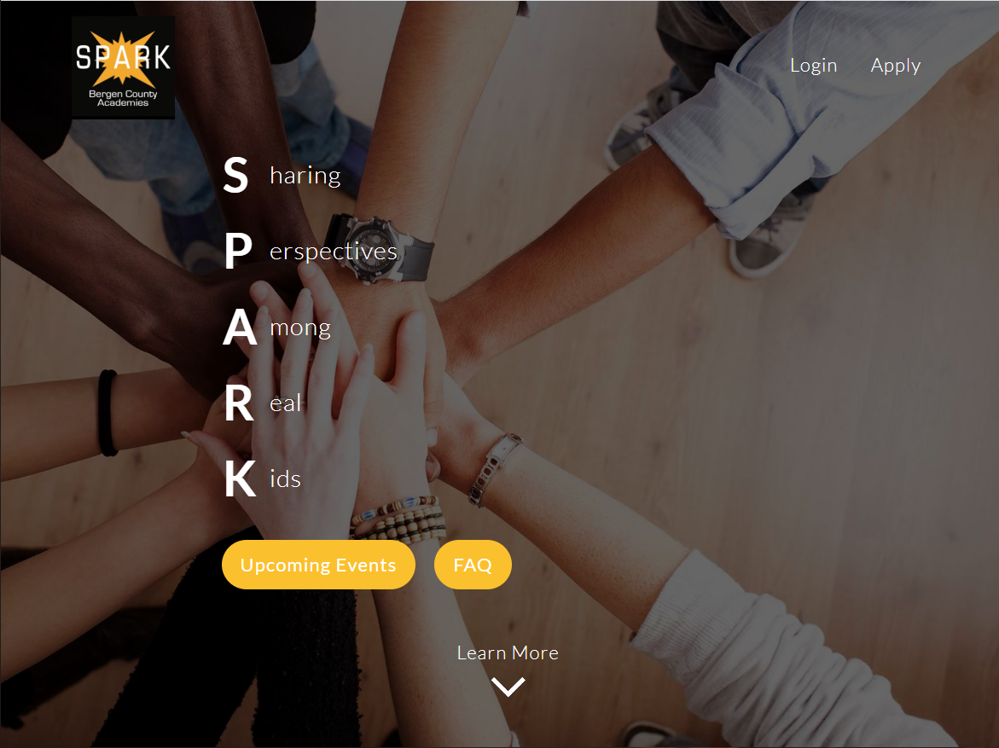

# BCA Spark Webste

> This website aims to centralize and organize the various aspects of the BCA Spark organization.

---

### Table of Contents
You're sections headers will be used to reference location of destination.

- [Description](#description)
- [How To Use](#how-to-use)
- [References](#references)
- [License](#license)
- [Author Info](#author-info)

---

## Description

Currently, the website has a ...
- Landing page to inform people about the spark organization
- Public calender where anyone can see spark events made public
- FAQ Page to see answered questions and submit questions of your own
- Secure login and apply functionality
- Functional application process with various stages (interactive on both the spark leader and applicant side)
- Calendar functionality for spark leaders to create events (can be private for spark leaders only or public for everyone to see)

### Technologies
- HTML
- CSS
- JavaScript
- EJS
- Node.js
- MongoDB

[Back To The Top](#bca-spark-website)

---

## How To Use

#### Installation

Part 1 - Installing the Necessary Technologies

1. We recommend installing [Visual Studio Code](https://code.visualstudio.com/download) for your editor and using VS Code's integrated terminal - see [here](https://stackoverflow.com/a/50527994) to set up on Windows
2. Install [git](https://git-scm.com/downloads)
3. Install [Node.js](https://nodejs.org/en/download/)
4. Install [Heroku CLI](https://devcenter.heroku.com/articles/heroku-cli#download-and-install) (subject to change but currently using Heroku for deployment)

Part 2 - Setting up the Project

1. Clone repository using the command "git clone https://github.com/Mars7543/Spark-Site.git"
3. Move .env file into project directory (see TEACHER_NAME_HERE)
4. Run command `npm install` in the root of the project to install node modules
5. Run command `npm run dev` to begin working on project (access project at localhost:8000)

#### Project Structure

- server.js: main file that runs the website
- views: contains all of the pages (ejs files) seen by the users
- routes: contains all of the different routes users can navigate to and sends the appropriate page from the views folder (also contains api addresses used in AJAX requests)
- middleware: contains user authentication functions used by the files in the routes folder
- models: contains mongoose schema files that describe the data sent, received, and modified from the database
- public: contains all statically served assetts (js/css/img files + landing page and other html files)

[Back To The Top](#bca-spark-website)

---

## Learning Material
[Back To The Top](#bca-spark-website)

We strongly recommend purchasing the [Complete Web Developer Bootcamp](https://www.udemy.com/course/the-web-developer-bootcamp/) by Colt Steele on Udemy for ~$15 (goes on sale about every other week)

This course will teach you the necessary technologies to make your own websites and (more importantly) to continue the development of this project.

A good routine would be to work on the course for about an hour during the week and 1.5 hours on weekends (at this rate it will take about a month to complete and get started on the project)

[Traversy Media](https://www.youtube.com/user/TechGuyWeb) also has a wide array of web development videos that can be useful.

---

## License

MIT License

Copyright (c) [2020] [Miguel Roberts & Alek Kaluza]

Permission is hereby granted, free of charge, to any person obtaining a copy
of this software and associated documentation files (the "Software"), to deal
in the Software without restriction, including without limitation the rights
to use, copy, modify, merge, publish, distribute, sublicense, and/or sell
copies of the Software, and to permit persons to whom the Software is
furnished to do so, subject to the following conditions:

The above copyright notice and this permission notice shall be included in all
copies or substantial portions of the Software.

THE SOFTWARE IS PROVIDED "AS IS", WITHOUT WARRANTY OF ANY KIND, EXPRESS OR
IMPLIED, INCLUDING BUT NOT LIMITED TO THE WARRANTIES OF MERCHANTABILITY,
FITNESS FOR A PARTICULAR PURPOSE AND NONINFRINGEMENT. IN NO EVENT SHALL THE
AUTHORS OR COPYRIGHT HOLDERS BE LIABLE FOR ANY CLAIM, DAMAGES OR OTHER
LIABILITY, WHETHER IN AN ACTION OF CONTRACT, TORT OR OTHERWISE, ARISING FROM,
OUT OF OR IN CONNECTION WITH THE SOFTWARE OR THE USE OR OTHER DEALINGS IN THE
SOFTWARE.

[Back To The Top](#bca-spark-website)

---

## Author Info

Alek and I really enjoyed working on this project and did our best to try and document our work and write readable code. Still, we understand that not everything will be perfect and you may encounter errors as you set up the project or as you improve old code and implement features of your own. Please feel free to reach out to us, using our contact information below and we will get back to you as soon as possible.

### Miguel Roberts
- Phone Number: +1 (917) 663-1919
- Email: miguelaroberts09@gmail.com

### Alek Kaluza
- Phone Number: +1 (551) 804-7903
- Email: aakaluza83@gmail.com

[Back To The Top](#bca-spark-website)